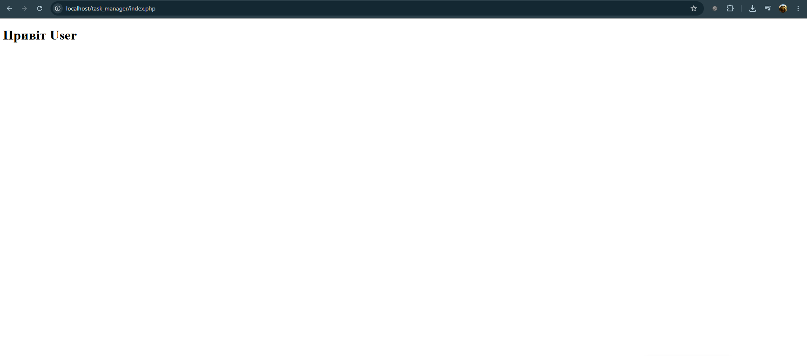

## Код програми (`index.php`)

```php
<?php
  echo "Привіт User";
?>
```
## Результат виконання



## Відповіді на контрольні запитання

1. **Яке призначення вебсервера (наприклад, Apache) у процесі веброзробки?**
   Для тестування PHP-коду на власному комп’ютері ...

2. **Яким розширенням файлу повинен володіти скрипт, щоб сервер обробив його як PHP-код?**
   Розширення має бути .php ...

3. **Чому PHP-файл потрібно відкривати через браузер за адресою localhost, а не просто подвійним кліком миші у файловому менеджері?**
   Файл потрібно так відкривати тому що, браузер сам по собі нерозуміє код PHP, а ми відкривая його таким способом так би мовити навчаємо ...

4. **За що відповідає конструкція echo у PHP?**
   Відповідає за те щоб динамічно намалювати щось на нашому сайті ...

5. **Яку інформацію виводить функція phpinfo() і для чого вона може знадобитись?**
   Функція виводить повну інформацію про поточний стан PHP на сервері. Ця інформація може знадобитися для того щоб: контролювати розширення, робити діагностику після оновлень тощо ...

